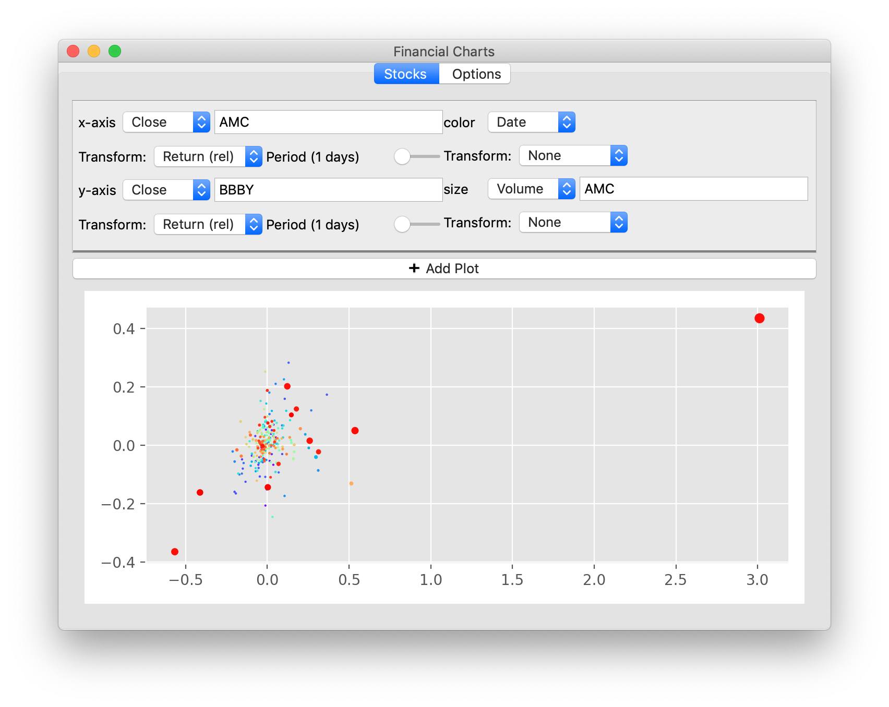
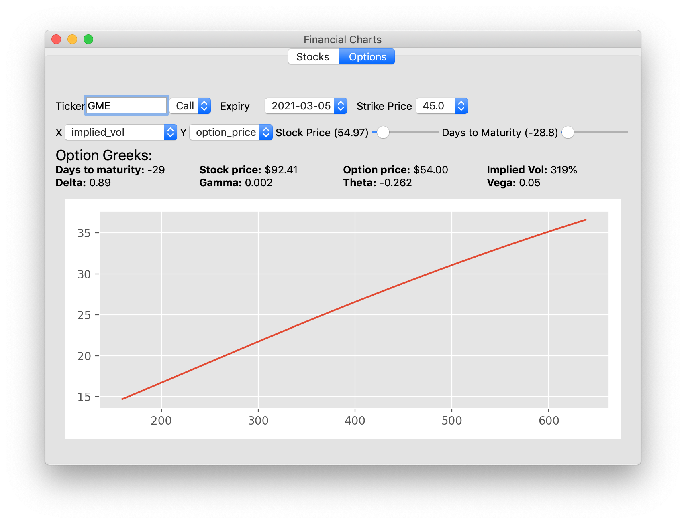
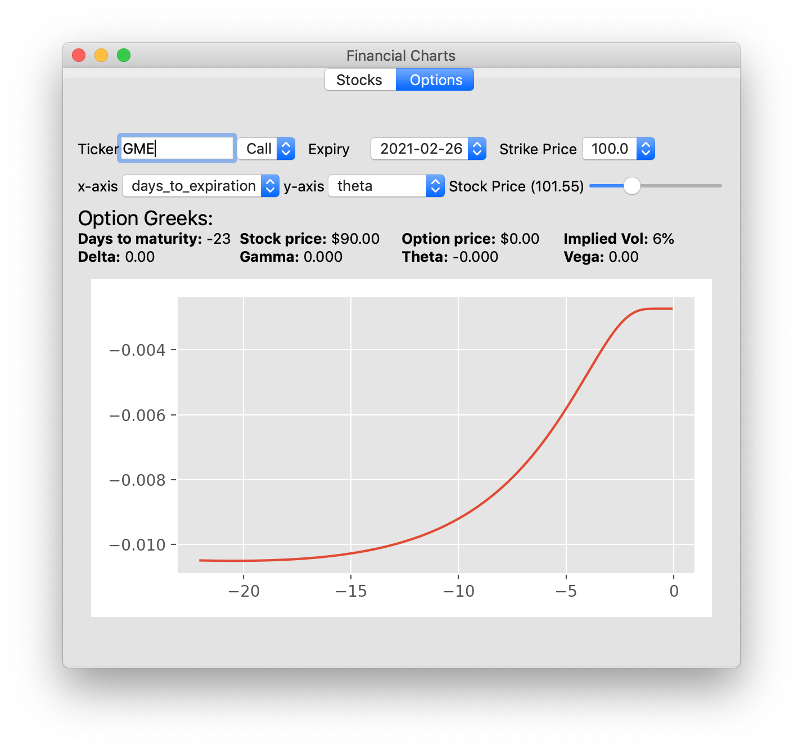

# Financial Charting Application

  

This application has two main functionality: plotting stocks against each other, and exploring options pricing.

The "stocks" portion of the application is essentially a GUI wrapper for grammar of graphics.
You specify the data source for the x-axis, y-axis, color, and point size along with the "geom" (line graph, scatter plot, histogram).
Each data source can optionally be transformed, for example by an EMA transform or a returns transform.
Many different useful plots can be described in this way:
* time vs stock price. You can also compare prices against a historical moving average.
* Histogram of returns: x-axis is the returns of one stock, and the geom is a histogram
* Correlation of two stocks: x-axis is the returns of one stock, y-axis is the returns of the other stock.
  By setting color and point-size, you can see how volume or date affects the correlation.

The "options" portion of the application is an interactive way to explore options pricing.
For a given stock, you can load the options at different strike prices and expirations.
The application will display the current values of the option greeks,
as well as a chart of each of the greeks (and the option price) against hypothetical stock prices
or days till maturity.
This allows you to see how option prices decay over time or the sensitivity of option parameters to stock price.

Libraries: 
- [Numpy](https://numpy.org/), [Matplotlib](https://matplotlib.org/) for plotting
- [Autograd](https://github.com/HIPS/autograd) and [scipy](https://www.scipy.org/) for the Black Scholes formula (to get the greeks automatically from the pricing function)
- [yfinance](https://pypi.org/project/yfinance/) for accessing Yahoo finance data
- [Edifice](https://www.pyedifice.org/) for UI.
